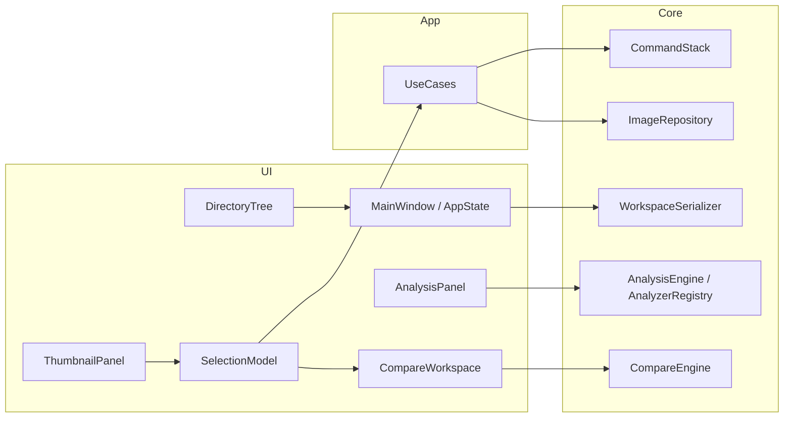

## User Requirements

对 MViewer 当前代码库做整体评审，并给出可执行的后续行动项计划，目标是增强产品力（让算法工程师更愿意每天使用），而非重做架构或扩写全部里程碑。

## Product Overview

MViewer 是面向图像算法工程师的视觉分析平台，核心工作流为 **浏览 → 比较 → 分析 → 导出**。当前版本约 **1.0.3 / Product Beta**，引擎层（解码/缓存/调度/比较/分析/插件 ABI）已达可发布质量；短板主要在专业工作流完成度、大目录体验验证、以及 Beta→1.0 的产品闭环。

## Core Features（当前已具备）

- 目录浏览 + 缩略图多视图 + 元数据/评分/标签
- 2–8 图同步比较（缩放/平移/ROI/闪烁/差分/叠加/连续比较）
- 分析引擎（直方图、PSNR/SSIM、噪声、锐度、MTF、ROI 等）+ 插件 SDK
- 五级缓存、异步解码、可选 GPU Stage A、安装包/便携包与 CI 门禁

## 评审结论（产品力视角）

- **能用**：主链路已闭环，不是“缺引擎”。
- **好用仍不足**：Directory Tree / Thumbnail / Compare 的专业打磨、Selection 统一、Workspace 完整恢复、万级目录性能验收、发布元数据自动化。
- **原则**：每 1000 行代码应对用户可感知价值；冻结 build/CI/分层架构；优先垂直工作流，不横向堆功能。

## Tech Stack Selection

- 沿用现有栈：C++20 + Qt 6 Widgets + CMake/Ninja（`build.ps1`）
- 分层不变：`UI → Application → Core → Domain`（domain/core 头文件无 Qt）
- 不改动冻结基础设施：`build.ps1`、`CMakePresets.json`、`.github/workflows/ci.yml`
- 验证门禁：本地 `.\build.ps1 Test` 全绿后再合入

## Implementation Approach

1. **以代码事实校准文档**：`docs/review/REVIEW_ACTION_ITEMS_2026-07-24.md` 中多项 A-x 已在源码落地（如 DirectoryTree 的 watcher/高亮、Thumbnail 的 SortType/类型过滤、Compare Overlay/连续比较、File*Command Undo、RatingStore）。计划以“验收缺口 + 用户可感缺口”为准，而非重复实现已有能力。
2. **产品力优先序**：先完成算法工程师日用闭环（Compare 收尾 + 浏览体验验收），再做资产/工作区恢复，最后才是 SDK/GPU/AI。
3. **验证驱动**：每个行动项绑定可观察验收标准（延迟、交互路径、崩溃恢复、导出一致性），用现有 `core_tests` / product suites / benchmark 扩展，不新造测试框架。
4. **性能**：万级目录与 100MP 路径只做测量与定点优化（`buildModel` 重建、缩略图可见优先、tile 视口裁剪），避免重写 Cache/Scheduler。

## Implementation Notes

- 复用：`SelectionModel`、`CompareWorkspace`、`ThumbnailPanel`、`DirectoryTree`、`AppState`/`WorkspaceSerializer`、`CommandStack`、`AnalyzerRegistry`、`RatingStore`
- 控制爆炸半径：只改 UI/Application 与必要 core 接口；禁止 domain 引入 Qt；禁止“为架构而架构”
- 文档同步：用户可见变更写 `CHANGELOG.md`；里程碑状态更新 `docs/roadmap.md` / `STATUS.md`
- 发布债：M14.8（SHA256 manifest + 自动 changelog）仍为开放项，纳入 1.0 发布准备，不阻塞日常产品打磨

## Architecture Design

保持现有架构，产品力工作落在工作流层：



## Directory Structure（后续改动焦点）

```
mviewer/
├── src/
│   ├── directorytree.{h,cpp}      # [MODIFY] 浏览路径全覆盖验收 + 大目录异步体验收尾
│   ├── thumbnailpanel.{h,cpp}     # [MODIFY] 视图/排序/过滤产品化 + 万级目录性能
│   ├── selectionmodel.{h,cpp}     # [MODIFY] 全局唯一选中源审计与接线
│   ├── compareworkspace.{h,cpp}   # [MODIFY] M16 收尾：布局预设、Pixel Link、编辑/指标打磨
│   ├── mainwindow.{h,cpp}         # [MODIFY] 工作流入口统一、快捷键、会话恢复
│   ├── appstate.{h,cpp}           # [MODIFY] 布局/缩放/Compare 会话完整恢复
│   ├── metadatapanel/overlay      # [MODIFY] 默认隐藏与呼出交互验收
│   └── core/
│       ├── command/               # [MODIFY] 批量原子 Command / Undo UI 完善
│       ├── workspace/             # [MODIFY] 崩溃恢复与会话序列化
│       └── compare/               # [MODIFY] 仅当 UI 能力需要 core 扩展时
├── docs/
│   ├── roadmap.md                 # [MODIFY] 里程碑状态与出口标准
│   ├── review/                    # [MODIFY] 行动项完成度对账
│   └── release/                   # [MODIFY] 1.0 发布清单
├── CHANGELOG.md / STATUS.md       # [MODIFY]
└── tests/ + src/core/test_*.cpp   # [MODIFY] 产品工作流与性能验收用例
```

## Key Decisions

| 决策 | 选择 | 理由 |
| --- | --- | --- |
| 是否重做引擎 | 否 | Cache/Scheduler/Decoder 已稳定 |
| 是否上 D3D11/Vulkan | 否 | UI 边界冻结；GPU Stage A 够用 |
| 是否先做 AI/全量 RAW | 否 | 产品 UX 未完全日用化前 ROI 低 |
| 下一主线 | M16 收尾 → Browse 验收 → Workspace/Asset → 1.0 发布 | 用户价值最大、风险可控 |